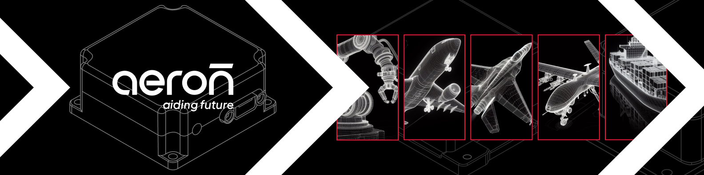

# Aeron Systems

Aeron Systems is a leading provider of advanced solutions in the fields of Inertial Navigation Systems and Industrial Internet of Things.

Our indigenously developed Inertial Navigation Systems serve a wide range of applications across defense, including drones, robotics, aircraft, and armored vehicles. In the automotive sector, our safety sensors enhance operations for heavy vehicles.

In the IoT vertical, Aeron delivers cutting-edge Wireless Data Loggers, Gateways, and Environment Monitoring Solutions. These include Weather, Air Quality, and Water Quality Monitoring systems, designed to meet the highest industry standards.
